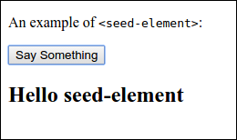

# seed-element

An element providing a starting point for your own reusable Polymer elements.



## Example Usage

Basic

```html
<seed-element></seed-element>
```

Fancy

```html
<seed-element fancy></seed-element>
```

With a fancy author and some content

```html
<seed-element author='{"name": "Lord Meowser", "image": "http://placekitten.com/g/200/300"}' fancy>
  <h2>Hello seed-element</h2>
</seed-element>
```

----

## How to use seed-element

- Check out the [Polymer Developer Resources](https://www.polymer-project.org/1.0/docs/devguide/feature-overview.html) and then follow the steps below to build and test your element.
- When you're ready to publish your element to the world, remove everything
under the above `<hr>` (`----`) and update the README above with a screenshot of your element
in action and some great example use cases.

## Dependencies

Element dependencies are managed via [Bower](http://bower.io/). You can
install that via:

    npm install -g bower

Then, go ahead and download the element's dependencies:

    bower install


## Playing With Your Element

If you wish to work on your element in isolation, we recommend that you use
[Polyserve](https://github.com/PolymerLabs/polyserve) to keep your element's
bower dependencies in line. You can install it via:

    npm install -g polyserve

And you can run it via:

    polyserve

Once running, you can preview your element at
`http://localhost:8080/components/seed-element/`, where `seed-element` is the name of the directory containing it.


## Testing Your Element

Simply navigate to the `/test` directory of your element to run its tests. If
you are using Polyserve: `http://localhost:8080/components/seed-element/test/`

### web-component-tester

The tests are compatible with [web-component-tester](https://github.com/Polymer/web-component-tester).
Install it via:

    npm install -g web-component-tester

Then, you can run your tests on _all_ of your local browsers via:

    wct

#### WCT Tips

`wct -l chrome` will only run tests in chrome.

`wct -p` will keep the browsers alive after test runs (refresh to re-run).

`wct test/some-file.html` will test only the files you specify.
